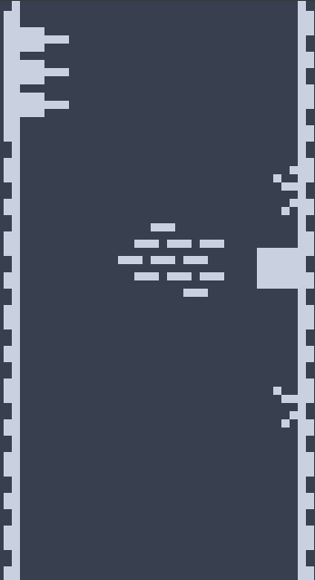
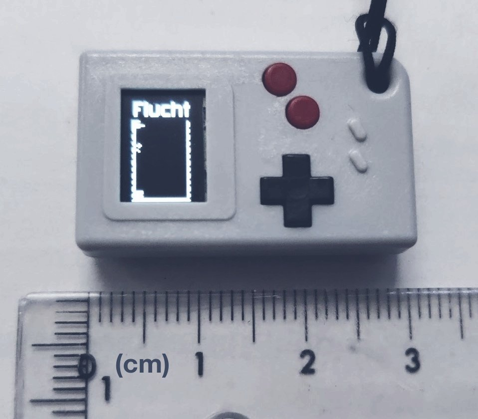

# Flucht

Wall jump as high as you can!

## **Play it on [itch.io](http://sergilazaro.itch.io/flucht)!**

This tiny game was developed for the tiny console [Thumby](https://tinycircuits.com/products/thumby), and I added a compatibility layer with [pygame](https://www.pygame.org/) to be able to play it on desktop, and WebAssembly using [pygbag](https://pypi.org/project/pygbag/) for browser support.

The game is played in portrait mode, which requires the console to be rotated 90 degrees, and it uses any of the buttons as input (the buttons are so small that it made sense as a design limitation).

## Structure

The game is split in three files: two platform compatibility layers (one for desktop/browser using pygame, the other one for the Thumby), and one that's platform-independent and shared between both platforms, which contains the actual game code.

The compatibility layer isn't exhaustive, I just implemented what I needed. But it could be a start for other projects. It's easier to debug and run if you have a native desktop version instead of using the official editor.

## Building

Run `./web_build.sh` which generates a zip file that contains the webasm files, which is what's uploaded to [itch.io](http://sergilazaro.itch.io/flucht) as-is.

You can also play the pygame desktop version by just running `game_pygame.py`.

